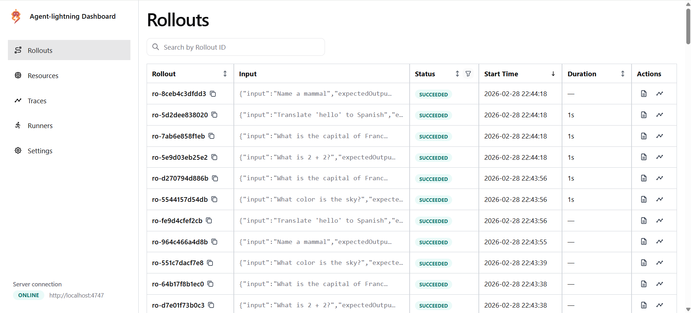
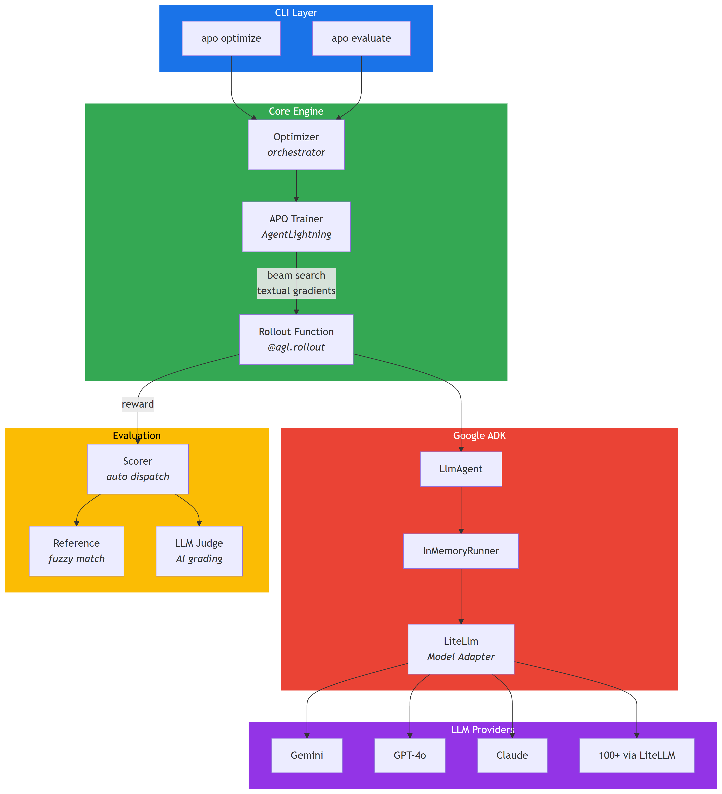
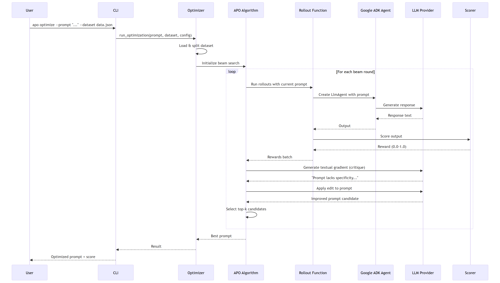

<p align="center">
  <h1 align="center">APO — Automatic Prompt Optimizer</h1>
  <p align="center">
    <strong>Automatically optimize your LLM prompts using gradient-based beam search</strong>
  </p>
  <p align="center">
    <a href="https://arxiv.org/abs/2305.03495">APO Paper</a> &middot;
    <a href="https://microsoft.github.io/agent-lightning/latest/algorithm-zoo/apo/">AgentLightning Docs</a> &middot;
    <a href="https://google.github.io/adk-docs/">Google ADK Docs</a>
  </p>
</p>

---

A CLI tool that takes your LLM prompt and makes it better — automatically. It uses the **APO (Automatic Prompt Optimization)** algorithm to iteratively critique, edit, and improve prompts through beam search over "textual gradients." Built with [Microsoft AgentLightning](https://github.com/microsoft/agent-lightning) for the optimization loop and [Google ADK](https://github.com/google/adk-python) with [LiteLLM](https://docs.litellm.ai/) for flexible model access across 100+ LLM providers.

## How It Works

APO treats prompt optimization like gradient descent, but with natural language instead of numbers:

1. **Evaluate** — Run your prompt on a batch of tasks and measure performance
2. **Critique** — An LLM generates "textual gradients" — natural language feedback about what's wrong
3. **Edit** — Another LLM applies the critique to produce improved prompt candidates
4. **Select** — Beam search keeps the top-k performing prompts
5. **Repeat** — Iterate until convergence

> *"APO is an iterative prompt optimization algorithm that uses LLM-generated textual gradients to improve prompts through a beam search process."* — [Pryzant et al., 2023](https://arxiv.org/abs/2305.03495)

## Dashboard

APO includes a **real-time dashboard** (powered by AgentLightning) that launches automatically at `http://localhost:4747` during optimization.

<p align="center">
  
</p>

| Tab | What It Shows |
|-----|---------------|
| **Rollouts** | Every prompt-on-task execution with status, input, duration |
| **Resources** | The prompt templates being optimized (your beam of candidates) |
| **Traces** | Detailed LLM call logs per rollout |
| **Runners** | Parallel workers and their current state |
| **Settings** | AgentLightning configuration |

## Architecture

<p align="center">
  
</p>

### Optimization Flow

<p align="center">
  
</p>

## Quick Start

### Prerequisites

- **Python 3.12+**
- **Linux or WSL** (AgentLightning requires Unix — see [Windows Setup](#windows-setup))
- **API Key** for at least one LLM provider (the model is auto-detected from your key)

### Installation

```bash
# Clone the repository
git clone https://github.com/pouriamrt/apo-adk-cli.git
cd apo-adk-cli

# Create virtual environment and install
uv venv
source .venv/bin/activate
uv pip install -e .

# Set up your API key
cp .env.example .env
# Edit .env with your actual API key
```

### Your First Optimization

```bash
# 1. Evaluate your current prompt to get a baseline score
apo evaluate \
  --prompt "Answer: {input}" \
  --dataset examples/sample_dataset.json \
  --eval-mode reference \
  --verbose

# 2. Optimize it
apo optimize \
  --prompt "Answer: {input}" \
  --dataset examples/sample_dataset.json \
  --beam-width 3 \
  --beam-rounds 3 \
  --output optimized_prompt.txt

# 3. Evaluate the optimized prompt to see the improvement
apo evaluate \
  --prompt-file optimized_prompt.txt \
  --dataset examples/sample_dataset.json \
  --eval-mode reference \
  --verbose
```

## Usage

### `apo optimize` — Optimize a Prompt

```bash
apo optimize \
  --prompt "Your prompt template with {input} placeholder" \
  --dataset path/to/dataset.json \
  --model "gemini/gemini-2.5-flash" \
  --optimizer-model "gemini-2.5-flash" \
  --eval-mode auto \
  --beam-width 3 \
  --beam-rounds 5 \
  --n-runners 4 \
  --output optimized_prompt.txt \
  --verbose
```

| Option | Default | Description |
|--------|---------|-------------|
| `--prompt` | — | Prompt template string (must contain `{input}`) |
| `--prompt-file` | — | Path to prompt template file (alternative to `--prompt`) |
| `--dataset` | *required* | Path to dataset file (JSON or CSV) |
| `--model` | *auto-detected* | LLM for running prompt rollouts ([LiteLLM format](https://docs.litellm.ai/docs/providers)) |
| `--optimizer-model` | *derived from `--model`* | LLM for APO gradient/edit steps |
| `--eval-mode` | `auto` | Scoring mode: `auto`, `reference`, or `llm-judge` |
| `--beam-width` | `3` | Number of top prompts kept per round |
| `--beam-rounds` | `5` | Number of optimization iterations |
| `--n-runners` | `4` | Parallel rollout workers |
| `--output` / `-o` | — | Save best prompt to file |
| `--verbose` / `-v` | `false` | Show per-rollout details |

### `apo evaluate` — Score a Prompt (No Optimization)

```bash
apo evaluate \
  --prompt-file my_prompt.txt \
  --dataset data.json \
  --model "openai/gpt-4o" \
  --eval-mode reference \
  --verbose
```

## Dataset Format

### JSON

```json
[
  {"input": "What is the capital of France?", "expected_output": "Paris"},
  {"input": "Translate 'hello' to Spanish", "expected_output": "hola"},
  {"input": "Summarize this article: ..."}
]
```

### CSV

```csv
input,expected_output
What is the capital of France?,Paris
Translate 'hello' to Spanish,hola
```

| Field | Required | Description |
|-------|----------|-------------|
| `input` | Yes | The variable part injected into `{input}` placeholder |
| `expected_output` | No | Ground truth for reference-based scoring |

## Prompt Template Format

Your prompt must contain the `{input}` placeholder. This is where each dataset task gets injected:

```text
You are a helpful assistant. Answer the following question
accurately and concisely.

{input}
```

APO optimizes the entire prompt text while preserving the `{input}` placeholder.

## Evaluation Modes

| Mode | When to Use | How It Works |
|------|-------------|--------------|
| `reference` | Dataset has `expected_output` | Fuzzy string matching + containment scoring |
| `llm-judge` | No ground truth available | A separate LLM grades output quality 0.0–1.0 |
| `auto` *(default)* | Mixed datasets | Uses `reference` when `expected_output` exists, `llm-judge` otherwise |

## Supported Models

Any model supported by [LiteLLM](https://docs.litellm.ai/docs/providers) works. Set the corresponding API key:

| Provider | Model String | Environment Variable |
|----------|-------------|---------------------|
| OpenAI | `openai/gpt-5.2` | `OPENAI_API_KEY` |
| Google Gemini | `gemini/gemini-2.5-flash` | `GOOGLE_API_KEY` |
| Anthropic | `anthropic/claude-sonnet-4-6` | `ANTHROPIC_API_KEY` |
| Ollama (local) | `ollama/llama3` | — |
| Azure OpenAI | `azure/gpt-4` | `AZURE_API_KEY` |

### Auto-Detection

When `--model` is omitted, APO automatically picks the best model based on which API key is set:

| API Key | Default Model |
|---------|--------------|
| `OPENAI_API_KEY` | `openai/gpt-5.2` |
| `GOOGLE_API_KEY` | `gemini/gemini-2.5-flash` |
| `ANTHROPIC_API_KEY` | `anthropic/claude-sonnet-4-6` |

If multiple keys are set, priority is: OpenAI > Google > Anthropic. You can always override with `--model`.

See the [full LiteLLM provider list](https://docs.litellm.ai/docs/providers) for 100+ supported models.

## Project Structure

```
ai-prompt-optimizer/
├── pyproject.toml                  # Dependencies & build config
├── .env.example                    # API key template
├── src/
│   └── apo/
│       ├── __init__.py
│       ├── cli/
│       │   └── commands.py         # Click CLI (optimize, evaluate)
│       ├── core/
│       │   ├── config.py           # APO parameter defaults
│       │   ├── optimizer.py        # Orchestrator: ties APO + ADK together
│       │   └── rollout.py          # @agl.rollout: ADK ↔ AgentLightning bridge
│       ├── evaluation/
│       │   ├── scorer.py           # Scoring dispatcher (auto/reference/llm-judge)
│       │   ├── reference.py        # Fuzzy string matching scorer
│       │   └── llm_judge.py        # LLM-as-judge scorer
│       └── data/
│           └── loader.py           # Dataset loading (JSON/CSV) + validation
├── examples/
│   ├── sample_dataset.json         # Example dataset (8 Q&A pairs)
│   └── sample_prompt.txt           # Example prompt template
├── tests/
│   ├── test_loader.py              # Dataset loader tests
│   ├── test_scoring.py             # Scorer tests
│   └── test_integration.py         # End-to-end CLI tests
└── docs/
    ├── apo-architecture.png        # Architecture diagram
    ├── apo-sequence.png            # Sequence diagram
    └── plans/                      # Design & implementation docs
```

## Windows Setup

AgentLightning depends on [gunicorn](https://gunicorn.org/), which is Unix-only. On Windows, use **WSL (Windows Subsystem for Linux)**:

```powershell
# 1. Install WSL if you haven't
wsl --install -d Ubuntu

# 2. In WSL, install uv
curl -LsSf https://astral.sh/uv/install.sh | sh
source ~/.local/bin/env

# 3. Navigate to the project
cd /mnt/c/path/to/AI-Prompt-optimizer

# 4. Create a Linux venv and install
uv venv .venv-wsl --python 3.12
source .venv-wsl/bin/activate
uv pip install -e .

# 5. Set your API key and run
export GOOGLE_API_KEY="your-key-here"
apo optimize --prompt "Answer: {input}" --dataset examples/sample_dataset.json
```

## How APO Works (Technical Details)

The APO algorithm ([Pryzant et al., 2023](https://arxiv.org/abs/2305.03495)) adapts gradient descent to natural language:

### Textual Gradients

Instead of numerical gradients, APO asks an LLM to critique the current prompt:

> *"The prompt is too vague — it doesn't specify the desired output format. The model sometimes returns full sentences when a single word would suffice."*

### Gradient Application

A second LLM call "applies" the gradient by editing the prompt in the corrective direction:

> **Before:** `"Answer: {input}"`
>
> **After:** `"Answer the following question with a single word or short phrase. Be precise and direct. {input}"`

### Beam Search

APO maintains a beam of the top-k performing prompts. Each round:

1. Sample parent prompts from the beam
2. Generate `branch_factor` new candidates per parent via textual gradients
3. Evaluate all candidates on a validation set
4. Keep the top `beam_width` prompts for the next round

This combines exploration (generating diverse candidates) with exploitation (keeping the best performers).

## Configuration Reference

All APO parameters with their defaults:

```python
APOConfig(
    model="gemini/gemini-2.5-flash",     # Rollout model (auto-detected if omitted)
    optimizer_model="gemini-2.5-flash",   # Gradient/edit model (derived from --model)
    beam_width=3,                         # Top prompts per round
    branch_factor=2,                      # Candidates per parent
    beam_rounds=5,                        # Optimization iterations
    gradient_batch_size=4,                # Samples for gradient computation
    val_batch_size=8,                     # Validation set size
    n_runners=4,                          # Parallel rollout workers
    eval_mode="auto",                     # auto | reference | llm-judge
    verbose=False,                        # Detailed output
)
```
 
## Built With

| Technology | Role |
|-----------|------|
| [AgentLightning](https://github.com/microsoft/agent-lightning) | APO algorithm & training loop |
| [Google ADK](https://github.com/google/adk-python) | Agent framework for prompt execution |
| [LiteLLM](https://github.com/BerriAI/litellm) | Unified interface to 100+ LLM providers |
| [Click](https://click.palletsprojects.com/) | CLI framework |
| [Rich](https://github.com/Textualize/rich) | Terminal output formatting |

## References

- **APO Paper:** [Automatic Prompt Optimization with "Gradient Descent" and Beam Search](https://arxiv.org/abs/2305.03495) — Pryzant et al., 2023
- **AgentLightning APO Docs:** [Algorithm Zoo — APO](https://microsoft.github.io/agent-lightning/latest/algorithm-zoo/apo/)
- **Google ADK + LiteLLM:** [Model Configuration](https://google.github.io/adk-docs/agents/models/litellm/)
- **Gemini OpenAI-Compatible API:** [OpenAI Compatibility](https://ai.google.dev/gemini-api/docs/openai)

## License

This project is for educational and research purposes.
